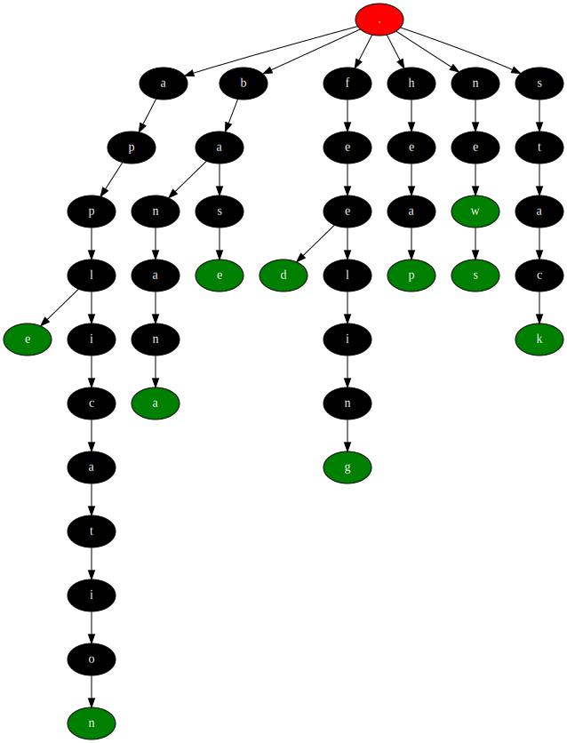
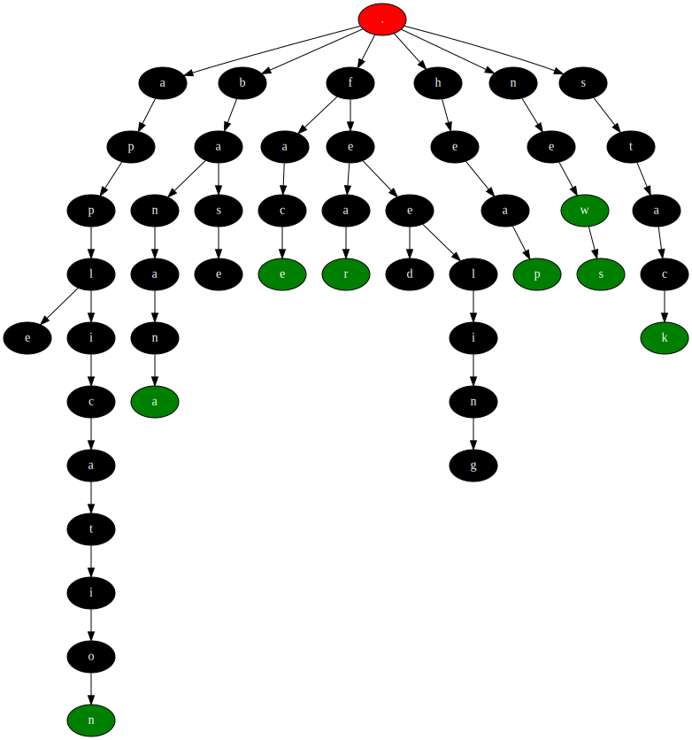
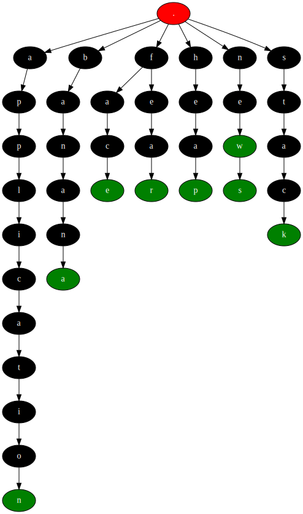

# fcmpl

### Description
An Auto Completion Engine that uses a Prefix Tree (also known as Trie). Can be used for implementing auto completion, where the engine suggests possible word completions (also does other things like spell-checking, generating dictionary graph, loading dictionary) based on the characters entered so far.

### Dependencies
[Graphviz](https://graphviz.org/) is used for visualizing tree. See [Tree Visualization](#tree-visualization)

[Installation instructions for Graphviz](https://graphviz.org/download/)

### Compilation
DEBUG flag compiles application with debug mode (includes logging, auto graph generation after each trie mutation)
```sh
$ make DEBUG=true|false
```

For tests
```sh
$ make test
```

For cleaning up
```sh
$ make clean
```

### Character set
[A-Za-z] are supported as a character set, but can be easily extended by modifying:
- ```#define NUMBER_OF_LETTERS 52``` macro that defines number of acceptable letters
- ```int hash(char ch)``` function to choose unique slot between [0 .. NUMBER_OF_LETTERS]

### Supported operations
- Adding new word
- Loading file of words
- Deleting existing word
- Spell-checking
- Completing prefix
- Generating dot and svg file for trie
- Generating dictionary txt file from existing trie

### REPL usage
```
$ ./bin/fcmpl
> .add accept
> .add account
> .add air
> .add above
> .delete above
> a
accept
account
air
> .load res/9-words.txt
> a
accept
account
air
apple
application
> .generate res/out.txt # will generate res/out.txt (list of words) from trie
> .generate res/out # will generate res/out.dot and res/out.svg
> .quit
Have a good day!
$ 
```

### Trie Visualization
Trie can be visualized with **.visualize** operation

If [res/9-words.txt](res/9-words.txt) is taken as a dictionary file, then two files will be generated after **.visualize** operation.
- out.dot
- out.svg

out.dot is dot file (the dot language **Graphviz** uses for generating graphs in different formats) that is generated from trie.
```dot
digraph {
  "0x5590788182c0" [label=".";fillcolor=red;style=filled;fontcolor=white]
  "0x55907881a050" [label="a";fillcolor=black;style=filled;fontcolor=white]
  "0x5590788182c0" -> "0x55907881a050"
  ...
}
```

out.svg



### DELETE_THRESHOLD for Rebalancing Trie
After certain number of deletions, trie should be balanced for better performance and memory by removing orphan nodes. DELETE_THRESHOLD is macro and equals to 50 (in compilation with DEBUG flag, equals to 5). It means trie will be rebalanced after DELETE_THRESHOLD times deletions.

Before Rebalance                               |  After Rebalance
:---------------------------------------------:|:--------------------------------------------:
  |  
